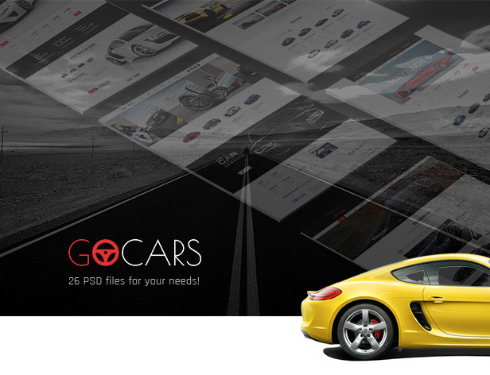
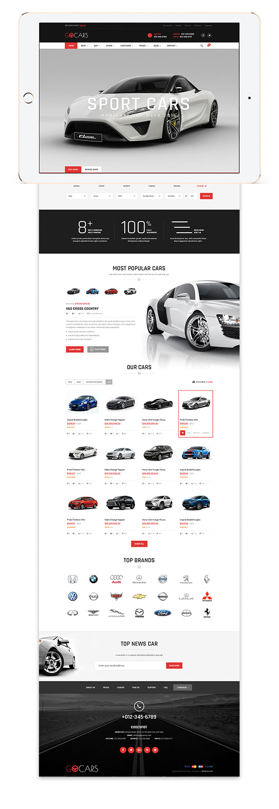
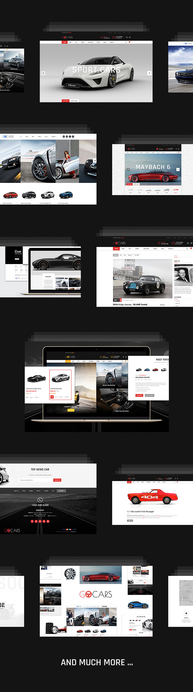
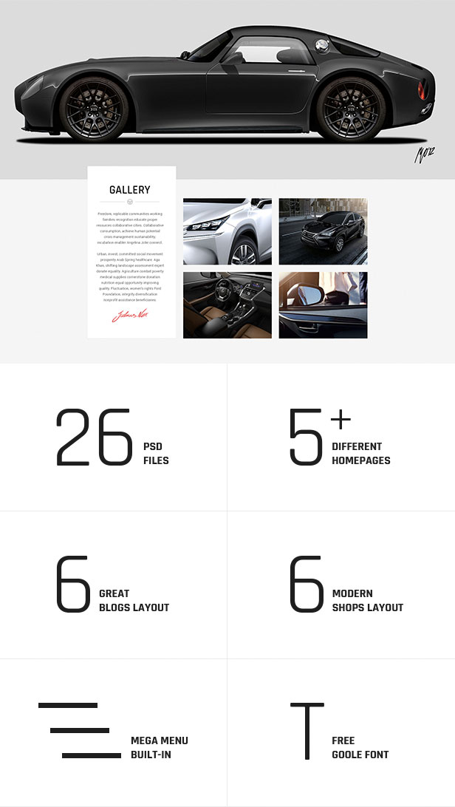

## NOTE FOR THEME DEVELOPERS:

*** If you like our design and would like to make CMS / eCommerce template for sell. Please feel free to contact us, we open for any partnership oppotunities.

# Go Cars - PSD Template Design for Car Dealers WordPress Site

PSD Template for Cars Dealers eCommerce Websites. Although it is designed based on WordPress platform, you can use this designs for other CMS like Joomla, Drupala as well as other ecommerce platform like Magento, PrestaShop, OpenCart, Shopify.

## The PSD template contains:

* 26 PSD files 
* 5 Different Homepages
* 6 Blog layouts
* 6 modern shop layouts
* Mega menu design
* Google fonts

## Modern Styles:

The PSD is designed with flat style, modern and luxury for automative, cars selling marketplace, online ecommerce stores. It also suitable for buy, sell, hire cars. Auction website for old cars and new cars, luxury or standard cars.

## Introduction:

GoCar is one of the most powerful car dealership themes purpose built to showcase your listings, loaded with more features than you can shake a stick at! It has everything you need to list and catalogue vehicles.

GoCar is a PSD Theme to sell, rent or buy your car online. This template is best suited for dealers, who need to do their business online via websites.

If you like our theme please do not forget to rate it! 

### MAIN ZIP FILE INCLUDES 3 FOLDERS

* **Doc** – Documentation for PSD template
* **Preview** – Preview JPG files to see all the pages design
* **PSD** – All the source PSD files for all designed pages

### KEY FEATURES

* 26 Fully Layered PSD Templates
* 5 Homepages
* 6 Shops Page
* 6 Blogs Page
* Easy to customize & use
* Well Organized Layers
* Customer Support
* Easy to Use and Customize
* Minimal Design
* Well organized layers
* Free Icons used
* Free Google Font
* And much more ...

### PSD CONTENTS

* 2 Homepage Full Width
* Homepage Fullscreen Photo
* Homepage Photo Carousel
* Homepage Boxed
* Blog Classic
* Blog List
* Blog Grid
* Blog Full Width
* Blog Masonry
* Blog Detail
* Shop FullWidth
* Shop Grid
* Shop List
* Shop Sidebar
* Shop Detail Sidebar
* Shop Detail Full Width
* About Us
* Contact Us
* Our Services
* Porfolios
* PricingTable
* FAQ
* Coming Soon
* 404 Error
* Mega Menu

## IMPORATANT NOTE

Photos in the preview image are used for display purposes only & not included in template.

